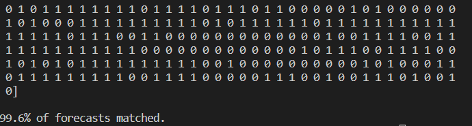

## <center> 华东师范大学数据科学与工程学院实验报告

| **课程名称：数据科学与工程算法基础** |**年级** ：2020级 |**上机实践成绩**： |
| --- | --- | --- |
| **指导教师** ：高明 | **姓名** ：杨舜 | **学号** ：10205501415 |
| **上机实践名称** ：EM算法 ||**上机实践日期**：2022.10.10 |
| **上机实践编号** ： | **组号 ：** |**上机实践时间**：2022.10.10 |

#### 一. 实验目的
了解EM算法的构建过程以及利用python代码实现，应用EM算法解决简单的实际问题
#### 二. 实验任务
利用客户购买历史和购物偏好的数据，采用高斯混合模型（GMM）来预测哪些类型的客户更有可能购买新产品。
#### 三. 实验过程

1. 实验假设
   本次实验中我们将已知变量定义为*x*，将未知标签定义为*y*，并做了两个假设：先验分布*p(y)*是二项式的，每个集群中的*p(x|y)*是高斯分布。即对于用户信息，我们认为用户的类别分为2类且分布满足二项式分布，不同类别的用户的特征信息为二维信息*x_1,x_2*,且满足二维高斯分布

2. 实验数据介绍
   在文件/data/unlabeled.csv,/data/labeled.csv中分别存放了1000个不同用户的数据，分为未进行类别标注的用户信息（用于无监督学习）以及进行了类别标注的用户信息（用于半监督学习），每个用户有2个特诊信息*x_1,x_2*,*(x_1,x_2)*满足二维高斯分布对于标注分类的数据中还有*y*,*y*满足二项式分布取值(0,1),为类别信息

3. 数据读入

   客户个人偏好未知，x1、x2表示客户的 2 个特征（假设客户数据服从高斯分布），我们的目标是预测客户是否喜欢该产品（y=1）或不喜欢（y=0）。

   

   ```python
   data_unlabeled = pd.read_csv("data/unlabeled.csv")
   x_unlabeled = data_unlabeled[["x1", "x2"]].values
   ```

4. 随机初始化参数

   对于无监督GMM，所有参数都是随机初始化的。为简单起见，我们使用 θ 来表示以下等式中的所有参数。
   $\theta := \phi,\mu_0,\mu_1,\Sigma_0,\Sigma_1$

   ```python
   def get_random_psd(n):#生成协方差矩阵
       x = np.random.normal(0, 1, size=(n, n))
       return np.dot(x, x.transpose())

   def initialize_random_params():
       params = {'phi': np.random.uniform(0, 1),
                 'mu0': np.random.normal(0, 1, size=(2,)),
                 'mu1': np.random.normal(0, 1, size=(2,)),
                 'sigma0': get_random_psd(2),
                 'sigma1': get_random_psd(2)}
       return params
   ```
 5. E步

   将初始化的参数传递给 `e_step()`并计算每个数据点的Q: `Q(y=1|x) 和 Q(y=0|x)`以及我们将在 M 步中最大化的平均对数似然。（Q由猜测的参数 θ 计算。）

   

   ```python
   def e_step(self, x):
        # *****START OF YOUR CODE (DO NOT DELETE/MODIFY THIS LINE)*****
        
        pdf = super().get_pdf(x)
        ## pdf[:,0] -- p(x|y=0;theta)p(y=0;theta)
        ## pdf[:,1] -- p(x|y=1;theta)p(y=1;theta)
        # print("\npdf ",pdf)

        pdf = np.array(pdf)
        # print("\npdf.shape ",pdf.shape)
        
        Q_y0 = pdf[:,0]/(pdf[:,0]+pdf[:,1])  ## 记录每一个样本中y的取值为0的概率
        # print("\nQ_y1 ",Q_y1)
        # print("\nQ_y1.shape ",Q_y0.shape)
        # print(np.max(Q_y0))
        
        Q_y1 = 1 - Q_y0                      ## 记录每一个样本中y的取值为1的概率  
        
        logLH = np.mean(np.log(pdf.sum(axis=1)))  ## 计算极大似然估计

        pass

        return Q_y0, Q_y1, logLH

        # *****END OF YOUR CODE (DO NOT DELETE/MODIFY THIS LINE)*****
   ```
   其中e_step实现了利用当前记录的迭代的参数估计来估计**y**取值为1或者0的概率，并计算此时极大似然对数的均值

6. M步
   
   利用之前实现的e_step()得到了最大化的似然期望以及y的先验概率，利用这些更新其他参数的先验概率，然后利用梯度上升来解决优化问题找到参数估计值
   ```python
   def m_step(self, x, Q_y0, Q_y1):
        # *****START OF YOUR CODE (DO NOT DELETE/MODIFY THIS LINE)*****
        
        # Q_y0, Q_y1 = self.e_step(x)
        
        N = x.shape[0] ## 样本数量
        
        phi = np.sum(Q_y1)/N
        
        # print("phi ",phi)
        # print("real phi ",self.params['phi'])

        Q_y0_re = Q_y0.reshape(N,1)
        Q_y1_re = Q_y1.reshape(N,1)
        mu0 = np.sum(Q_y0_re*x,axis = 0)/np.sum(Q_y0)
        mu1 = np.sum(Q_y1_re*x,axis = 0)/np.sum(Q_y1)

        # print("mu0 ",mu0)
        # print("real mu0 ",self.params['mu0'])
        # print("mu1 ",mu1)
        # print("real mu1 ",self.params['mu1'])

        sqrt_q_y0 = np.sqrt(Q_y0).reshape(N,1)
        sqrt_q_y1 = np.sqrt(Q_y1).reshape(N,1)
        x_mu0 = x - mu0
        x_mu1 = x - mu1
        x_mu0 = x_mu0*sqrt_q_y0
        x_mu1 = x_mu1*sqrt_q_y1
        x_mu0_T = x_mu0.T
        x_mu1_T = x_mu1.T
        sigma0 = x_mu0_T.dot(x_mu0)/np.sum(Q_y0)
        sigma1 = x_mu1_T.dot(x_mu1)/np.sum(Q_y1)
        # print(sigma0)
        # print(sigma1)
        # print( ((x[0,:]-mu0).T).dot(x[0,:]-mu0))
        # for i in range(N):
            
        
        pass

        # *****END OF YOUR CODE (DO NOT DELETE/MODIFY THIS LINE)*****
        self.params = {'phi': phi, 'mu0': mu0, 'mu1': mu1, 'sigma0': sigma0, 'sigma1': sigma1}
        return self.params
   ```

7. 迭代更新
   在E步中利用现在估计的参数迭代得到极大似然均值并获得新的Q,在M步中利用E步中得到的新的Q和似然均值根据梯度上升获取新的参数估计。EM算法所做的是重复运行以上步骤直至平均对数似然收敛。在本题实验使用数据中假设迭代更新30次。
   ```python
   def run_em(self,x):
        # *****START OF YOUR CODE (DO NOT DELETE/MODIFY THIS LINE)*****
        echo_times = 30
        Q_y0 = Q_y1 = []
        predict_proba = []
        for _ in range(echo_times):
            Q_y0, Q_y1, logLH = self.e_step(x)
            self.logLHs.append(logLH)
            self.m_step(x,Q_y0,Q_y1)
            # self.visualization(x,'runing')
        # print(self.params)
        predict_proba.append(Q_y0)
        predict_proba.append(Q_y1)
        predict_proba = np.array(predict_proba)
        predict_proba = predict_proba.T
        # print("predict_proba.shape ",predict_proba.shape)
        # print(Q_y0)
        # plt.figure(figsize=(8,5))
        # x_axis = [i for i in range(echo_times)]
        # plt.plot(x_axis, logLHs, label="line L", color='lime', alpha=0.8, linewidth=2, linestyle="--")
        # plt.show()
        
        mask = Q_y1 > 0.5 ## 将多次迭代后y取1的概率大于0.5的样本预测为类别1
        forecast = 1*mask

        print("\tphi: {}\n \
            \tmu_0: {}\n \
            \tmu_1: {}\n \
            \tsigma0: {}\n \
            \tsigma1: {}\n".format(self.params['phi'],self.params['mu0'],self.params['mu1'],self.params['sigma1'],self.params['sigma1']))
        pass
        return forecast, predict_proba

        # *****END OF YOUR CODE (DO NOT DELETE/MODIFY THIS LINE)*****
   ```
   其中run_em得到对于样本类别的预测以及参数y的后验概率
   样本的预测利用收敛后的y的后验概率在实现，将取值为0/1的概率大于0.5的样本分类为类别0/1

8. 实现可视化
   
   直接在EM类中实现可视化接口，对于求解过程中极大似然函数对数的变化、以及对应分类轮廓的变化进行记录
   
   ```python
   def visualization(self,X,name):
        print("visualization")
        # ax1.figure(figsize=(8,5))
        x_axis = [i for i in range(len(self.logLHs))]
        plt.plot(x_axis, self.logLHs, label="line L", color='lime', alpha=0.8, linewidth=2, linestyle="--")
        plt.title(name+"likehood")
        plt.show()
        
        # def plot_clusters(X, Mu, Var, Mu_true=None, Var_true=None):
        colors = ['b', 'r', 'g']
        n_clusters = 2
        
        # plt.figure(figsize=(8, 5))
        plt.scatter(X[:, 0], X[:, 1], s=5,c = colors[2])
        ax = plt.gca()
        for i in range(n_clusters):
            Var = self.params['sigma'+str(i)]
            plot_args = {'fc': 'None', 'lw': 2, 'edgecolor': colors[i], 'ls': ':'}
            ellipse = Ellipse(self.params['mu'+str(i)], 5 * Var[0][0], 4 * Var[1][1], **plot_args)
            ax.add_patch(ellipse)   
        plt.title(name)
        plt.show()

        return
   ```

#### 四. 实验分析
   循环迭代30次，在此过程中极大似然函数对数的值的变化如下图：
   
   
   
   在循环迭代的过程中对于两类样本的分类边界（以半监督为例,以此时迭代得到的参数mu为圆心，sigma方差为椭圆的长轴和短轴做类别边界）的变化情况如下图所示
   
   
   
   
   
   

   迭代完成后得到的分类边界如下图

   
   
   
   最后比较sklearn函数包有如下结果

   

   结果基本一致。   
 
               
#### 五. 总结
- EM算法是一种优化迭代策略，最适合数据集不完全的情况， 常用来预测高斯混合模型的参数，隐式马尔科夫，该算法分为E步（期望步）和M布（极大步）。基本思想是：先根据已经观测的数据，估计出模型的参数，然后使用这些参数，估计缺失的数据，将缺失的数据和已经观测的数据再重新估计参数，如此反复，直到收敛。
- 在此次的实验中我们可以发现在EM算法的迭代过程中GMM模型的极大似然对数期望会在较少的迭代次数后就趋于平稳，并在此后的迭代过程中无明显变化
- 高斯混合模型建模过程为多个高斯分布线性相加；不同的高斯分布组成视为模型中的隐变量。
- EM算法适合用于求解含有隐变量的生成模型，适合GMM的参数求解。